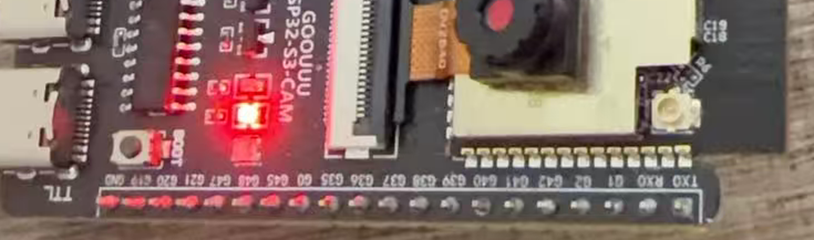

# sesame agent esp32

An AI agent that lives on an ESP32-S3 and controls the hardware it is running on.

Ask it in plain language to take a photo, probe an I2C bus, move a servo, record audio, or fetch a web page, and it does the work on the board itself. There is no companion app and no cloud middleman. The only thing it calls out to is the model API you point it at.



## How it works

The device runs a small shell with 58 commands. Those same commands are reachable four ways: over USB serial, over SSH, over HTTP, and by the model as its single tool. Adding a command adds it everywhere at once, and the model's system prompt is generated from the live command table, so it always knows exactly what this build can do.

The model is whatever you configure. It speaks the OpenAI chat completions format, so DeepSeek, OpenAI, OpenRouter, Groq, Together, or a local llama.cpp server all work. The API key is stored on the device and never leaves it except to reach your chosen endpoint.


## Flashing it

A prebuilt image is committed at [`firmware/sesame-agent-esp32.bin`](firmware/sesame-agent-esp32.bin), so cloning the repo gives you everything at once. It is a single merged file containing the bootloader, partition table and application at their correct offsets, and you do not need the toolchain to flash it.

```
pip install esptool
git clone https://github.com/vcup-date/sesame-agent-esp32.git
cd sesame-agent-esp32
```

Hold the BOOT button, tap RESET, release BOOT, then:

```
esptool.py --chip esp32s3 --baud 460800 write_flash 0x0 firmware/sesame-agent-esp32.bin
```

That is the whole install. The same file is attached to the [latest release](../../releases/latest) if you would rather not clone.

This image starts at offset 0 and covers the NVS partition, so flashing it clears any saved Wi-Fi credentials, API key and settings, and the device comes up in setup mode again. That is what you want on a new board. If you are reflashing one that is already configured and would rather keep its settings, write only the application instead:

```
esptool.py --chip esp32s3 --baud 460800 write_flash 0x10000 build/sesame-agent-esp32.bin
```

If the board is not detected, check that your cable carries data rather than power only. This is the single most common cause. On macOS the port is usually `/dev/cu.usbserial-*`, on Linux `/dev/ttyUSB0`, on Windows a COM port. Pass it with `-p` if esptool guesses wrong.

## Getting it on your network

Nothing is hardcoded. On first boot the device has no credentials, so it opens its own Wi-Fi network and waits.

1. Power the board. It creates an **open** access point called `sesame-agent`. No password, because typing a password to reach a page where you type a password is a bad first minute.
2. Join that network from a phone or laptop. The setup page opens by itself on most devices, using DHCP option 114 with a DNS redirect as a fallback. If it does not appear, open `http://192.168.4.1`.
3. Pick your network, enter the password, and optionally paste an API key. You can skip the key and set it later.
4. The device joins your network and the setup access point disappears.


Only **2.4 GHz** networks are listed. The ESP32-S3 has no 5 GHz radio at all, so a network that never appears is almost certainly 5 GHz only. This trips up a lot of people with modern mesh routers that hide the band split.

After it joins, reach it at `http://sesame-xxxx.local`, where `xxxx` comes from the board's MAC address. Every board gets a distinct name, so several of them on one network do not collide. The exact name is printed on the serial console at boot and shown in the setup page.

To change networks later, use the Settings panel in the web interface, or `wifi connect <ssid> <password>` from any console. To start over completely, `wifi forget` and reboot.

## The web interface

Served from the board itself, roughly 60 KB, no external assets, no framework, no tracking. It works offline on your LAN.

- Chat with tool calls shown inline, so you can watch what it ran and what came back
- Conversation history, and refreshing returns you to the last conversation
- A stop button that works mid-turn, served from a second HTTP server on port 81 so it stays responsive while the main server is busy with a request
- File browser with download and delete, plus free space
- Wi-Fi scan and join
- Provider profiles, so you can keep DeepSeek and a local model side by side and switch
- Light and dark themes, English and Chinese
- Photos taken by the camera appear as thumbnails you can open and download

It is built for a phone as much as a laptop.

<p align="center"></p>


## What you can ask it

Real examples that work:

- "Take a photo and tell me how much space is left"
- "What is on the I2C bus?"
- "Fetch example.com, save it, and summarise it in one line"
- "Blink the LED three times, then tell me the chip temperature"
- "Scan for Bluetooth devices and list the closest three"
- "Write a Python script that counts to ten, save it, and run it"

When a task needs logic that no single command expresses, it writes MicroPython and runs it on the device.

## Commands

All 58 are available from the serial console, SSH, the web terminal, and to the agent.

**System**  `help` `sysinfo` `free` `uptime` `reboot` `cfg`
`sysinfo` reports why it last restarted, which distinguishes a crash from a brownout from a deliberate reboot.

**Files**  `ls` `cat` `write` `rm` `mkdir` `df` `cp` `mv` `head` `tail` `grep` `wc` `touch` `rmdir` `tree` `text`
`text` converts saved HTML into readable plain text, which is what makes fetching a web page useful rather than dumping tags into the model's context.

**Network**  `wifi` `ping` `resolve` `netstat` `http` `time` `sniff` `peer`
`http` does HTTPS with certificate verification and can stream a response straight to a file with `-o`, so a download is not limited by RAM.

**Hardware**  `gpio` `adc` `i2c` `i2creg` `pwm` `servo` `stepper` `dac` `tone` `ir` `spi` `i2s` `rgb` `led` `uart` `pins` `mon` `temp` `rand` `sleep`
`pins` prints a live map of every GPIO, what is using it, and which are free.
`mon` samples a value over time and draws a sparkline, which answers "is it drifting" rather than "what is it now".

**Camera**  `snap` `camera`

**Bluetooth**  `ble` (scan for nearby devices, or advertise this one)

**Display**  `disp` (SSD1306 OLED over the camera's I2C bus)

**Agent**  `ask` `agent`

**Python**  `py` (MicroPython, for loops and arithmetic the shell cannot express)

**Remote**  `ssh` (a real SSH server with a persistent host key)

## Hardware notes

**A real analog output without a DAC.** The ESP32-S3 has no DAC peripheral. The `dac` command uses the sigma-delta modulator instead, which produces a pulse density that becomes a genuine analog voltage or a sine wave once you put a resistor and capacitor on the pin. It can play a short tune with `dac play 2 523:150,659:150,784:300`.

**Servos done properly.** `pwm` runs LEDC at 8 bit, which at the 50 Hz a servo needs gives about a dozen distinct positions across 180 degrees. `servo` uses MCPWM with a 1 MHz tick, so the pulse width is set directly in microseconds, the unit servos are specified in.

**Steppers, both common kinds.** `stepper step` drives an A4988 or DRV8825 style step and direction driver. `stepper 4wire` drives a 28BYJ-48 through a ULN2003.

**Infrared, no protocol assumed.** `ir rx` records the raw mark and space timings from any remote, `ir tx` replays them through a 38 kHz carrier. The output of one pastes directly into the other, so it works with remotes whose protocol nobody has documented.

**Audio in and out.** `i2s play` and `i2s tone` drive a MAX98357A style amplifier. `i2s rec` and `i2s pdmrec` record 16 bit mono WAV from an INMP441, SPH0645, or a PDM microphone. Recording reports the peak level, so a silent file reads as a wiring problem instead of looking like success.

**Board to board messaging.** `peer` uses ESP-NOW, which needs no router. Each device announces its name every few seconds, and messages are addressed by name. Messages relay up to 4 hops with a seen-message cache and randomised delay before forwarding, so two agents that cannot hear each other directly can still talk through a third. The relay design follows [bitchat](https://github.com/permissionlesstech/bitchat), which is public domain.

**Passive radio survey.** `sniff` counts frames by type and by transmitter on a channel, which tells you whether the air is congested. It reads frame headers only. It does not capture payloads, and there is deliberately no frame injection counterpart.

## Pins on this board

The camera occupies most of the low GPIOs. `pins` prints this live, but for reference:

| Function | GPIO |
|---|---|
| Camera XCLK, SIOD, SIOC | 15, 4, 5 |
| Camera data D0 to D7 | 11, 9, 8, 10, 12, 18, 17, 16 |
| Camera VSYNC, HREF, PCLK | 6, 7, 13 |
| WS2812 status LED | 48 |
| microSD CMD, CLK, DATA | 38, 39, 40 |
| UART console | 43, 44 |
| Free for your own use | 1, 2, 14, 21, 41, 42, 47 |

Two ranges are dangerous and are blocked in software. GPIO 26 to 32 are the SPI flash. GPIO 33 to 37 are the octal PSRAM bus on this module, and driving one hangs the chip instantly with no chance to report it.

The board has three LEDs. Red is wired straight across the 3.3 V rail with no GPIO, so it is always on and nothing can change it. Blue sits on GPIO43, which is also the UART transmit line, so it flickers with console traffic and cannot serve as a status light without giving up the serial console. The addressable RGB LED on GPIO48 is the one this firmware uses: it breathes blue when idle, pulses amber while thinking, flashes green on success and red on error.

## Building from source

Requires ESP-IDF v5.5.

```
git clone https://github.com/vcup-date/sesame-agent-esp32.git
cd sesame-agent-esp32
idf.py set-target esp32s3
idf.py build
idf.py -p /dev/ttyUSB0 flash monitor
```

The MicroPython embed package under `components/micropython/micropython_embed` is generated output and is committed so that a fresh clone builds without extra steps. To regenerate it after changing `mpconfigport.h`, run `components/micropython/regen.sh` with a MicroPython checkout available.

`tools/smoke.py` runs a post-flash check over serial and HTTP, covering boot integrity, the filesystem, Python, GPIO, and the web endpoints.

## Limits

The shell is not bash. There are no pipes, no redirection, no globbing, and no `&&`. One command per call. `grep <pattern> <file>` rather than `cat file | grep pattern`.

MicroPython here is pure computation. There is no `machine` module, no file access, and no pin access from Python. Anything touching hardware has to be a C command, which is why the command list is as long as it is.

`peer` messages are not encrypted and not signed. Anything in radio range can read them, and a name inside a packet is a claim rather than proof.

The camera, Wi-Fi, SSH, web interface, ESP-NOW, BLE, sigma-delta output, and infrared transmit have all been verified on real hardware. The servo, stepper, I2S audio, SPI and OLED paths compile and validate their arguments but have not been tested against the physical devices, because none were connected during development. Treat first contact with those as debugging rather than as a regression.

## Tested on

Developed on a GOOUUU ESP32-S3-CAM (16 MB flash, 8 MB octal PSRAM, OV2640). Other ESP32-S3 camera boards should work if you set the camera pinout with `cfg set cam.pins pwdn,reset,xclk,siod,sioc,d7,d6,d5,d4,d3,d2,d1,d0,vsync,href,pclk`.

## License

MIT. See [LICENSE](LICENSE).

MicroPython is included under its own MIT license, see `components/micropython/micropython_embed/LICENSE`.
