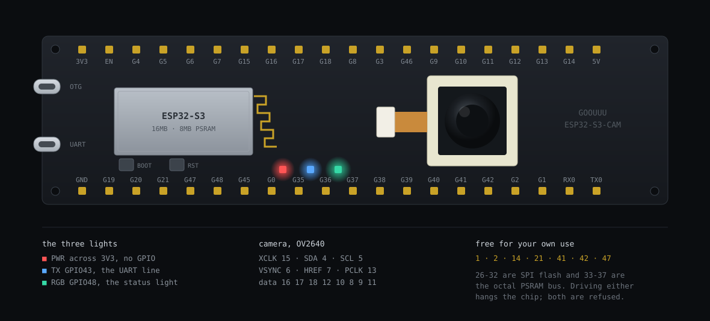
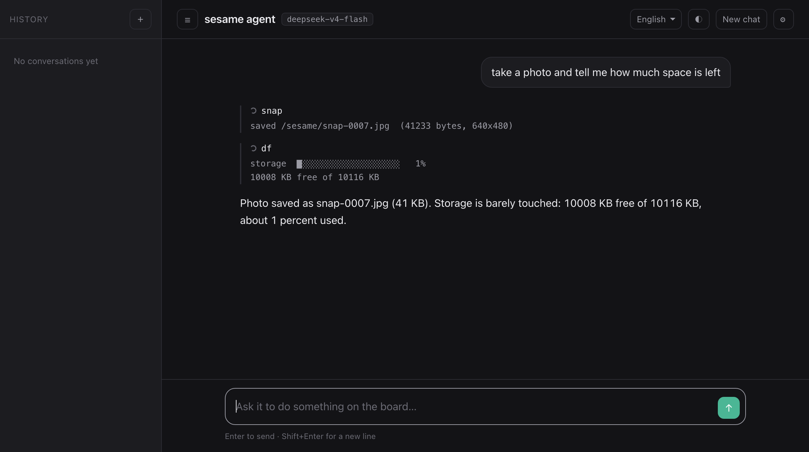
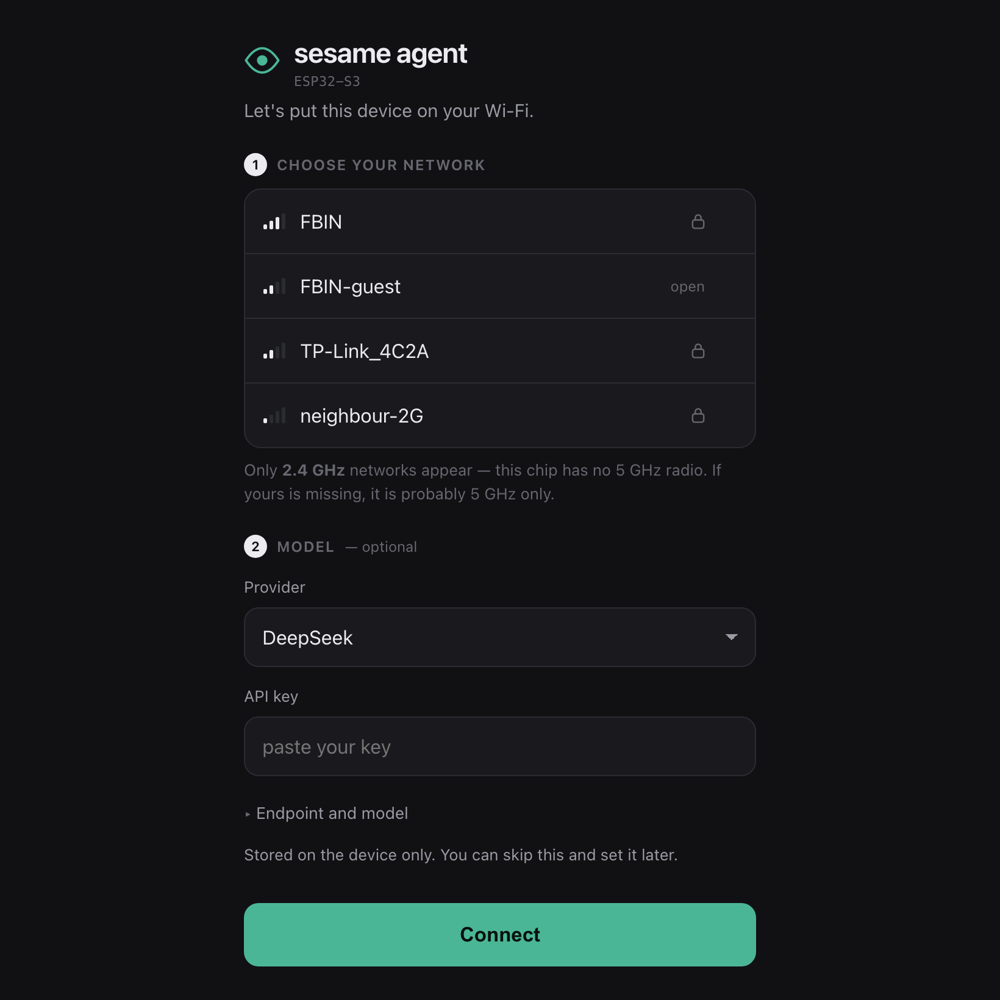
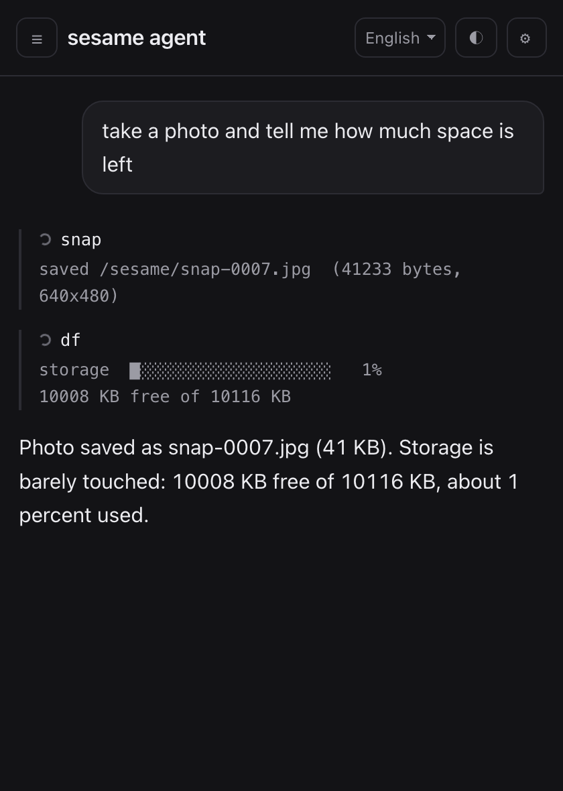
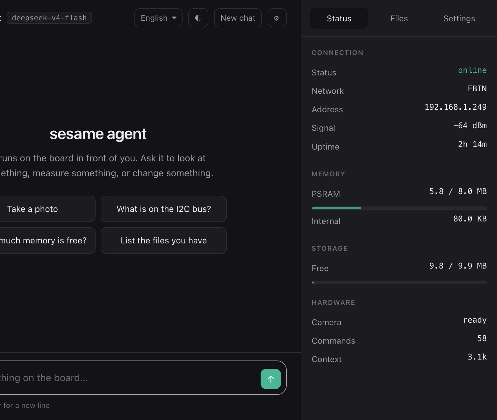

# sesame agent esp32

An AI agent that lives on an ESP32-S3 and controls the hardware it is running on.

Ask it in plain language to take a photo, probe an I2C bus, move a servo, record audio, or fetch a web page, and it does the work on the board itself. There is no companion app and no cloud middleman. The only thing it calls out to is the model API you point it at.



## How it works

The device runs a small shell. Its commands are reachable four ways: over USB serial, over SSH, over HTTP, and by the model as its single tool. Adding a command adds it everywhere at once, and the model's system prompt is generated from the live command table, so it always knows exactly what this build can do.

The model is whatever you configure. It speaks the OpenAI chat completions format, so DeepSeek, OpenAI, OpenRouter, Groq, Together, or a local llama.cpp server all work. The API key is stored on the device and never leaves it except to reach your chosen endpoint.



## Flashing it

A prebuilt image is committed at [`firmware/sesame-agent-esp32.bin`](firmware/sesame-agent-esp32.bin), so cloning the repo gives you everything at once. It is a single merged file containing the bootloader, partition table and application at their correct offsets, and you do not need the toolchain to flash it.

```
pip install esptool
git clone https://github.com/vcup-date/sesame-agent-esp32.git
cd sesame-agent-esp32
```

Hold the BOOT button, tap RESET, release BOOT, then:

```
esptool.py --chip esp32s3 --baud 460800 write_flash 0x0 firmware/sesame-agent-esp32.bin
```

That is the whole install. The same file is attached to the [latest release](../../releases/latest) if you would rather not clone.

This image starts at offset 0 and covers the NVS partition, so flashing it clears any saved Wi-Fi credentials, API key and settings, and the device comes up in setup mode again. That is what you want on a new board. If you are reflashing one that is already configured and would rather keep its settings, write only the application instead:

```
esptool.py --chip esp32s3 --baud 460800 write_flash 0x10000 build/sesame-agent-esp32.bin
```

If the board is not detected, check that your cable carries data rather than power only. This is the single most common cause. On macOS the port is usually `/dev/cu.usbserial-*`, on Linux `/dev/ttyUSB0`, on Windows a COM port. Pass it with `-p` if esptool guesses wrong.

## Getting it on your network

Nothing is hardcoded. On first boot the device has no credentials, so it opens its own Wi-Fi network and waits.

1. Power the board. It creates an **open** access point called `sesame-agent`. No password, because typing a password to reach a page where you type a password is a bad first minute.
2. Join that network from a phone or laptop. The setup page opens by itself on most devices, using DHCP option 114 with a DNS redirect as a fallback. If it does not appear, open `http://192.168.4.1`.
3. Pick your network, enter the password, and optionally paste an API key. You can skip the key and set it later.
4. The device joins your network and the setup access point disappears.



Only **2.4 GHz** networks are listed. The ESP32-S3 has no 5 GHz radio at all, so a network that never appears is almost certainly 5 GHz only. This trips up a lot of people with modern mesh routers that hide the band split.

After it joins, reach it at `http://sesame-xxxx.local`, where `xxxx` comes from the board's MAC address. Every board gets a distinct name, so several of them on one network do not collide. The exact name is printed on the serial console at boot and shown in the setup page.

To change networks later, use the Settings panel in the web interface, or `wifi connect <ssid> <password>` from any console. To start over completely, `wifi forget` and reboot.

## SSH

The SSH server is on by default with **admin / admin**, so it works the moment the board is on your network.

```
ssh admin@sesame-xxxx.local
passwd <a better password>
```

Change it. Anyone who can reach port 22 gets full control of the board, and the login warns you while the default is still in place.

The `agent` command puts the session into conversation mode, where every line goes to the model and tool calls are shown as they run. `exit` returns to the shell.

```
sesame-ede4> agent
conversation mode. ask in plain language; 'exit' returns to the shell.
sesame-ede4 ask> what is on the i2c bus?
  · i2c scan
    0x3c
There is one device at 0x3c, which is the address an SSD1306 OLED uses.
sesame-ede4 ask> exit
```

## The web interface

Served from the board itself, roughly 60 KB, no external assets, no framework, no tracking. It works offline on your LAN.

- Chat with tool calls shown inline, so you can watch what it ran and what came back
- Conversation history, and refreshing returns you to the last conversation
- A stop button that works mid-turn, served from a second HTTP server on port 81 so it stays responsive while the main server is busy with a request
- File browser with download and delete, plus free space
- Wi-Fi scan and join
- Provider profiles, so you can keep DeepSeek and a local model side by side and switch
- Light and dark themes, English and Chinese
- Photos taken by the camera appear as thumbnails you can open and download

It is built for a phone as much as a laptop.

<p align="center"></p>



## What you can ask it

Real examples that work:

- "Take a photo and tell me how much space is left"
- "What is on the I2C bus?"
- "Fetch example.com, save it, and summarise it in one line"
- "Blink the LED three times, then tell me the chip temperature"
- "Scan for Bluetooth devices and list the closest three"
- "Write a Python script that counts to ten, save it, and run it"

When a task needs logic that no single command expresses, it writes MicroPython and runs it on the device.

## Commands

Reachable four ways: serial console, SSH, `POST /api/exec`, and the agent's `shell` tool.

### Files and text

| | |
|---|---|
| `ls [dir]` | long listing: type, size, name |
| `cat <file>` | print a file |
| `write <file> <text>` | write text, newlines and indentation kept as sent |
| `cp <src> <dst>` | copy, byte exact, binary safe |
| `mv <src> <dst>` | rename or move |
| `rm <file>` · `rmdir <dir>` · `mkdir <dir>` · `touch <file>` | the obvious ones |
| `head <file> [n]` · `tail <file> [n]` | first or last lines, up to 2000 |
| `grep <text> <file>` | matching lines with numbers, up to 400 |
| `wc <file>` | lines, words, bytes |
| `tree [dir]` | recursive listing with sizes, 12 deep |
| `df` · `free` | space on flash, and heap in SRAM and PSRAM |
| `text <file.html> [chars]` | strip HTML to readable text |

### Network

| | |
|---|---|
| `wifi [status\|scan\|connect <ssid> <pw>\|static <ip> <gw>\|dhcp\|forget]` | join, inspect, or fix an address |
| `ping <host> [count]` | ICMP with per packet RTT and loss |
| `resolve <host>` · `netstat` | DNS lookup; interfaces, DNS and open ports |
| `http <url> [-o <file>]` | HTTPS with certificate verification, streams to a file |
| `time [sync]` | clock, NTP |
| `sniff [seconds] [channel]` | passive frame counts per transmitter, headers only |
| `peer [list\|send <name\|all> <text>\|inbox]` | message other boards over ESP-NOW, 4 hop mesh |

### Agent, shell and scheduling

| | |
|---|---|
| `agent` | enter conversation mode, `exit` leaves |
| `agent status\|reset` | model, context, cache hit rate; clear the conversation |
| `ask <request>` | one request without entering the REPL |
| `seq [xN] <cmd>; <cmd>; ...` | run a list in ONE call, `wait <ms>` between steps |
| `cron add [-g] [-k] <secs\|once> <cmd>` | schedule; `-g` survives reboot, `-k` never expires |
| `cron list\|del <id\|all>\|pause\|resume` | manage jobs |
| `skill list\|show <name>\|rm <name>` | saved procedures, read on demand |
| `python` | interactive session, `>>>` and `...`, `exit` leaves |
| `python <code>` · `python -f <file>` | run without entering a session (`py` is a short alias) |
| `cfg [list\|get\|set]` · `passwd <pw> [user]` | settings; change the SSH password |
| `ssh` · `sysinfo` · `uptime` · `reboot` · `help [cmd]` | |

`seq` matters more than it looks. Every tool call is a network round trip, so
a colour sweep sent one command at a time is slow and can exhaust the per turn
budget. `seq x3 rgb 255 0 0; wait 150; rgb 0 0 255; wait 150` is one call and
the timing is the device's.

### Hardware

Pin numbers are GPIO numbers. `pins` prints which are free.

**`gpio get <pin> [up|down]` · `gpio set <pin> <0|1>`**
Read a pin, optionally with an internal pull, or drive it. The pull is what
distinguishes a floating pin from one something is actually holding: with the
pull up on, a disconnected pin reads 1 and a pin held down still reads 0.
```
gpio get 4 up        →  1  (pull-up)
gpio set 2 1
```

**`adc <channel 0-9>`** ADC1, roughly 0 to 3100 mV, 12 bit.
```
adc 3                →  channel 3: raw 2048 (~1550 mV)
```

**`pwm <pin> <duty 0-255> [freq]`** LEDC, default 5 kHz. For brightness and
speed, not for servos: at 50 Hz an 8 bit duty gives about a dozen usable steps.
```
pwm 2 128 1000
```

**`servo <pin> <angle 0-180> [min_us] [max_us]` · `servo <pin> us <n>` · `servo release <pin>`**
MCPWM at a 1 MHz tick, so the pulse is set in microseconds, the unit servos are
specified in. Defaults 500 to 2500 us. `release` stops the pulse train so the
servo stops holding torque. Power a servo from its own supply, not the 3V3 pin.
```
servo 2 90           →  servo 2: 1500 us (90 deg)
servo 2 us 1750
```

**`stepper step <step_pin> <dir_pin> <steps> [rpm]`**
**`stepper 4wire <p1> <p2> <p3> <p4> <steps> [rpm]`**
`step` drives an A4988 or DRV8825 style driver; `4wire` drives a 28BYJ-48
through a ULN2003. Negative steps reverse. Coils are de-energised at the end so
the motor does not cook. Blocks while running, capped at 25 s.
```
stepper 4wire 1 2 14 21 2048 15      →  2048 steps forward at 15 rpm
stepper step 4 5 -400 120
```

**`dac <pin> <level 0-255>` · `dac tone <pin> <hz> [ms]` · `dac play <pin> <hz:ms,...>` · `dac off`**
The S3 has no DAC. This is the sigma delta modulator, which emits a pulse
density that becomes a real voltage or sine wave once you put an RC low pass
filter on the pin (1k and 100nF works). Without the filter the pin is still
just a fast digital toggle.
```
dac 2 128                              →  half of VDD
dac tone 2 440 500                     →  a real 440 Hz sine
dac play 2 523:150,659:150,784:300     →  C E G
```

**`tone <pin> <hz> [ms]`** Square wave for a passive buzzer. Cruder than `dac`
and needs no filter.

**`ir rx <pin> [ms]` · `ir tx <pin> <+mark,-space,...>`**
Records raw mark and space timings in microseconds and replays them through a
38 kHz carrier. No protocol is decoded, so it works with remotes nobody has
documented. `rx` output pastes straight into `tx`. Needs a demodulating
receiver such as a TSOP38238 to record, and an IR LED to send.
```
ir rx 14 8000        →  +9000,-4500,+560,-560,...
ir tx 2 +9000,-4500,+560,-560
```

**`i2c scan [sda] [scl]`** i2cdetect style grid. Defaults to the camera's bus
(sda 4, scl 5), which it shares rather than fighting.

**`i2creg read <addr> <reg> [n]` · `i2creg write <addr> <reg> <hex...>`**
Register access without a driver. Addresses and registers in hex.
```
i2creg read 3c 00 2
i2creg write 3c 00 af
```

**`spi <sclk> <mosi> <miso|-1> <cs> <hex...>`** One full duplex transfer on
SPI2 at 1 MHz. SPI1 is the flash and PSRAM and is not touchable.

**`i2s tone|play <bclk> <lrclk> <dout> ...`** Audio out to a MAX98357A style
amplifier.
**`i2s rec <bclk> <ws> <din> <file.wav> [secs] [rate]`**
**`i2s pdmrec <clk> <din> <file.wav> [secs] [rate]`**
Records 16 bit mono WAV from an INMP441 or SPH0645, or a PDM microphone. The
peak level is reported, so a silent file reads as a wiring fault rather than as
success.

**`rgb <r> <g> <b> [pin]` · `rgb off`** The WS2812 on GPIO48, driven over RMT.
A plain `gpio set` cannot light it: it needs timed bit encoding.

**`led [status|idle|think|ok|error|off]`** The status animation on the same
LED. Blue breathing when idle, amber pulse while thinking, green on success,
red on error.

**`ble [status|scan [secs]|adv on|off]`** Scan for nearby devices, or advertise
this one. Broadcaster only, so nothing can connect to it. The stack costs about
58 KB of internal RAM and is released again after a scan.

**`snap` · `camera [status|pins]`** Take a photo to `/sesame/photos`, or
inspect the sensor and its pinout.

**`disp <text>`** SSD1306 OLED over the camera's I2C bus.

**`uart <tx> <rx> <baud> [text]`** Talk to a GPS, modem or another board on
UART1. UART0 is the console and is deliberately out of reach.

**`mon <heap|adc <ch>|gpio <pin>> [samples] [ms]`** Sample a value over time
and draw a sparkline, which answers "is it drifting" rather than "what is it
now".

**`pins [free]`** Live map of every GPIO and what is using it.

**`temp` · `rand [n]` · `sleep <secs>`** Die temperature, hardware random
numbers, deep sleep with a timer or GPIO wake.


## Pins on this board

The camera occupies most of the low GPIOs. `pins` prints this live, but for reference:

| Function | GPIO |
|---|---|
| Camera XCLK, SIOD, SIOC | 15, 4, 5 |
| Camera data D0 to D7 | 11, 9, 8, 10, 12, 18, 17, 16 |
| Camera VSYNC, HREF, PCLK | 6, 7, 13 |
| WS2812 status LED | 48 |
| microSD CMD, CLK, DATA | 38, 39, 40 |
| UART console | 43, 44 |
| Free for your own use | 1, 2, 14, 21, 41, 42, 47 |

Two ranges are dangerous and are blocked in software. GPIO 26 to 32 are the SPI flash. GPIO 33 to 37 are the octal PSRAM bus on this module, and driving one hangs the chip instantly with no chance to report it.

The board has three LEDs. Red is wired straight across the 3.3 V rail with no GPIO, so it is always on and nothing can change it. Blue sits on GPIO43, which is also the UART transmit line, so it flickers with console traffic and cannot serve as a status light without giving up the serial console. The addressable RGB LED on GPIO48 is the one this firmware uses: it breathes blue when idle, pulses amber while thinking, flashes green on success and red on error.

## Building from source

Requires ESP-IDF v5.5.

```
git clone https://github.com/vcup-date/sesame-agent-esp32.git
cd sesame-agent-esp32
idf.py set-target esp32s3
idf.py build
idf.py -p /dev/ttyUSB0 flash monitor
```

The MicroPython embed package under `components/micropython/micropython_embed` is generated output and is committed so that a fresh clone builds without extra steps. To regenerate it after changing `mpconfigport.h`, run `components/micropython/regen.sh` with a MicroPython checkout available.

`tools/smoke.py` runs a post-flash check over serial and HTTP, covering boot integrity, the filesystem, Python, GPIO, and the web endpoints.

## Limits

The shell is not bash. There are no pipes, no redirection, no globbing and no `&&`. `grep <pattern> <file>` rather than `cat file | grep pattern`. `seq` covers the common case of several steps with timing in one call, but it is a list, not a language: no variables, no conditions, no loops beyond `xN`.

MicroPython here is pure computation. `python` opens a real interactive session with `>>>` and `...` prompts, expression echo and persistent state, but there is no `machine` module, no file access and no pin access from it. Anything touching hardware has to be a C command, which is why the command list is as long as it is.

`peer` messages are not encrypted and not signed. Anything in radio range can read them, and a name inside a packet is a claim rather than proof.

There is no authentication on the web interface, and SSH ships with a default password. Both give complete control of the board, including running arbitrary commands. This is built for a network you trust. Change the SSH password with `passwd`, and do not expose either to the internet without putting real authentication in front of them first.

The camera, Wi-Fi, SSH, web interface, ESP-NOW, BLE, sigma-delta output and infrared transmit have all been verified on real hardware. The servo, stepper, I2S audio, SPI and OLED paths compile and validate their arguments, and the commands respond correctly, but they have not been tested against the physical devices because none were connected during development. Treat first contact with those as debugging rather than as a regression.

The conversation is held in PSRAM, which measured at almost exactly one byte per character of encoded JSON, putting the ceiling near 1.5M tokens. `agent.ctx` defaults to 1M characters, roughly 256k tokens, and accepts up to 4.5M. The limit worth caring about is not memory but upload: the request is re-sent on every hop and TLS on this chip tops out around 90 KB/s, so a very large conversation costs real seconds per step.

## Tested on

Developed on a GOOUUU ESP32-S3-CAM (16 MB flash, 8 MB octal PSRAM, OV2640). Other ESP32-S3 camera boards should work if you set the camera pinout with `cfg set cam.pins pwdn,reset,xclk,siod,sioc,d7,d6,d5,d4,d3,d2,d1,d0,vsync,href,pclk`.

## License

MIT. See [LICENSE](LICENSE).

MicroPython is included under its own MIT license, see `components/micropython/micropython_embed/LICENSE`.
